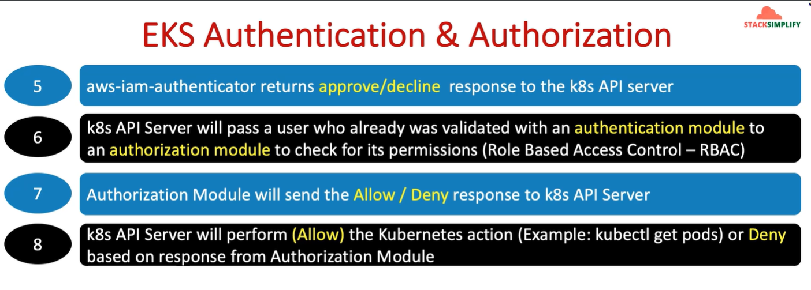
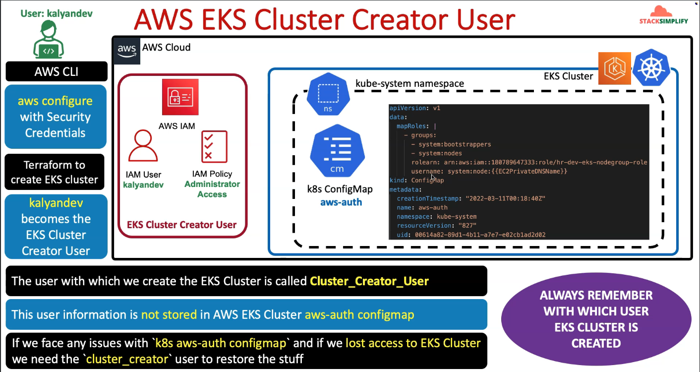
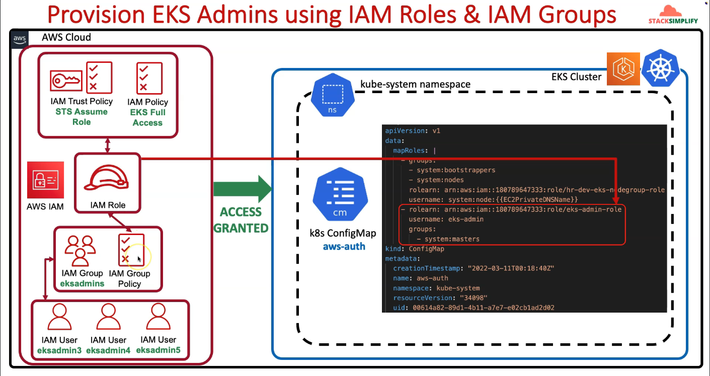

## Flow:-








## Step-01: Introduction
- We are going to manage AWS EKS aws-auth configmap using Terraform.

## Step-02: v8-01-iam-admin-user.tf
```t
# Resource: AWS IAM User - Admin User (Has Full AWS Access)
resource "aws_iam_user" "admin_user" {
  name = "${local.name}-eksadmin1"
  path = "/"
  force_destroy = true
  tags = local.common_tags
}

# Resource: Admin Access Policy - Attach it to admin user
resource "aws_iam_user_policy_attachment" "admin_user" {
  user       = aws_iam_user.admin_user.name
  policy_arn = "arn:aws:iam::aws:policy/AdministratorAccess"
}
```
## Step-03: v8-02-iam-basic-user.tf
```t
# Resource: AWS IAM User - Basic User (No AWSConsole Access)
resource "aws_iam_user" "basic_user" {
  name = "${local.name}-eksadmin2"
  path = "/"
  force_destroy = true
  tags = local.common_tags
}

# Resource: AWS IAM User Policy - EKS Full Access
resource "aws_iam_user_policy" "basic_user_eks_policy" {
  name = "${local.name}-eks-full-access-policy"
  user = aws_iam_user.basic_user.name

  # Terraform's "jsonencode" function converts a
  # Terraform expression result to valid JSON syntax.
  policy = jsonencode({
    Version = "2012-10-17"
    Statement = [
      {
        Action = [
          "iam:ListRoles",
          "eks:*",
          "ssm:GetParameter"
        ]
        Effect   = "Allow"
        Resource = "*"
        #Resource = "${aws_eks_cluster.eks_cluster.arn}"
      },
    ]
  })
}

```

## Step-04: v7-01-kubernetes-provider.tf
```t
# Datasource: 
data "aws_eks_cluster_auth" "cluster" {
  name = aws_eks_cluster.eks_cluster.id
}

# Terraform Kubernetes Provider
provider "kubernetes" {
  host = aws_eks_cluster.eks_cluster.endpoint
  cluster_ca_certificate = base64decode(aws_eks_cluster.eks_cluster.certificate_authority[0].data)
  token = data.aws_eks_cluster_auth.cluster.token
}
```

## Step-05: v7-02-kubernetes-configmap.tf
```t
# Get AWS Account ID
data "aws_caller_identity" "current" {}
output "account_id" {
  value = data.aws_caller_identity.current.account_id
}

# Sample Role Format: arn:aws:iam::180789647333:role/hr-dev-eks-nodegroup-role
# Locals Block
locals {
  configmap_roles = [
    {
      rolearn  = "arn:aws:iam::${data.aws_caller_identity.current.account_id}:role/${aws_iam_role.eks_nodegroup_role.name}"
      username = "system:node:{{EC2PrivateDNSName}}"
      groups   = ["system:bootstrappers", "system:nodes"]
    },
  ]
  configmap_users = [
    {
      userarn  = "${aws_iam_user.basic_user.arn}"
      username = "${aws_iam_user.basic_user.name}"
      groups   = ["system:masters"]
    },
    {
      userarn  = "${aws_iam_user.admin_user.arn}"
      username = "${aws_iam_user.admin_user.name}"
      groups   = ["system:masters"]
    },    
  ]
}
# Resource: Kubernetes Config Map
resource "kubernetes_config_map_v1" "aws_auth" {
  depends_on = [aws_eks_cluster.eks_cluster  ]
  metadata {
    name      = "aws-auth"
    namespace = "kube-system"
  }
  data = {
    mapRoles = yamlencode(local.configmap_roles)
    mapUsers = yamlencode(local.configmap_users)
  }  
}
```

## Step-06: v5-07-eks-node-group-public.tf
- Update `depends_on` Meta-Argument with configmap `kubernetes_config_map_v1.aws_auth`.
- When EKS Cluster is created, kubernetes object `aws-auth` configmap will not get created
- `aws-auth` configmap will be created when the first EKS Node Group gets created to update the EKS Nodes related role information in `aws-auth` configmap. 
-  That said, we will populate the equivalent `aws-auth` configmap before creating the EKS Node Group and also we will create EKS Node Group only after configMap `aws-auth` resource is created.
- If we have plans to create "Fargate Profiles", its equivalent `aws-auth` configmap related entries need to be updated.
- **File Name:** c5-07-eks-node-group-public.tf
```t
  # Otherwise, EKS will not be able to properly delete EC2 Instances and Elastic Network Interfaces.
  depends_on = [
    aws_iam_role_policy_attachment.eks-AmazonEKSWorkerNodePolicy,
    aws_iam_role_policy_attachment.eks-AmazonEKS_CNI_Policy,
    aws_iam_role_policy_attachment.eks-AmazonEC2ContainerRegistryReadOnly,
    kubernetes_config_map_v1.aws_auth 
  ] 
```
## Step-07: Execute Terraform Commands
```t
# Get current user configured in AWS CLI
aws sts get-caller-identity
Observation:
1. Make a note of EKS Cluster Creator user.

# Terraform Initialize
terraform init

# Terraform Validate
terraform validate

# Terraform plan
terraform plan

# Terraform Apply
terraform apply -auto-approve
```
## Step-08: Access EKS Cluster with hr-dev-eksadmin1 user (AWS IAM Admin User)
### Step-08-01: Set Credentials for hr-dev-eksadmin1 user
```t
# Set password for hr-dev-eksadmin1 user
aws iam create-login-profile --user-name hr-dev-eksadmin1 --password @EKSUser101 --no-password-reset-required

# Create Security Credentials for IAM User and make a note of them
aws iam create-access-key --user-name hr-dev-eksadmin1

# Make a note of Access Key ID and Secret Access Key
User: hr-dev-eksadmin1
{
    "AccessKey": {
        "UserName": "hr-dev-eksadmin1",
        "AccessKeyId": "",
        "Status": "Active",
        "SecretAccessKey": "",
        "CreateDate": "2022-03-12T04:21:33+00:00"
    }
}
```
### Step-08-02: Access EKS  Service using AWS Mgmt Console
- Login and access EKS Service using AWS Mgmt Console
  - **Username:** hr-dev-eksadmin1
  - **Password:** @EKSUser101
- Go to  Services -> Elastic Kubernetes Service -> hr-dev-eksdemo1
  - Overview Tab
  - Workloads Tab
  - Configuration Tab


### Step-08-03: Configure hr-dev-eksadmin1 user AWS CLI Profile
```t
# To list all configuration data
aws configure list

# To list all your profile names
aws configure list-profiles

# Configure aws cli hr-dev-eksadmin1 Profile 
aws configure --profile hr-dev-eksadmin1
AWS Access Key ID: <>
AWS Secret Access Key: <>
Default region: us-east-1
Default output format: json

# To list all your profile names
aws configure list-profiles
```  

### Step-08-04: Access EKS Resources using kubectl
```t
# Clean-Up kubeconfig
>$HOME/.kube/config
cat $HOME/.kube/config

# Configure kubeconfig for kubectl with AWS CLI Profile hr-dev-eksadmin1
aws eks --region <region-code> update-kubeconfig --name <cluster_name> --profile <AWS-CLI-PROFILE-NAME>
aws eks --region us-east-1 update-kubeconfig --name hr-dev-eksdemo1 --profile hr-dev-eksadmin1
Observation:
1. It should pass

# Verify kubeconfig 
cat $HOME/.kube/config
      env:
      - name: AWS_PROFILE
        value: hr-dev-eksadmin1
Observation: At the end of kubeconfig file we find that AWS_PROFILE it is using is "hr-dev-eksadmin1" profile   


# List Kubernetes Nodes
kubectl get nodes

# Review aws-auth configmap
kubectl -n kube-system get configmap aws-auth -o yaml
Observation:
1. We should see both users in mapUsers section
```

## Step-09: Access EKS Cluster with hr-dev-eksadmin2 user (AWS Basic User)
### Step-09-01: Set Credentials for hr-dev-eksadmin2 user
```t
# Set password for hr-dev-eksadmin2 user
aws iam create-login-profile --user-name hr-dev-eksadmin2 --password @EKSUser101 --no-password-reset-required

# Create Security Credentials for IAM User and make a note of them
aws iam create-access-key --user-name hr-dev-eksadmin2

# Make a note of Access Key ID and Secret Access Key
User: hr-dev-eksadmin1
{
    "AccessKey": {
        "UserName": "hr-dev-eksadmin2",
        "AccessKeyId": "",
        "Status": "Active",
        "SecretAccessKey": "",
        "CreateDate": ""
    }
}
```
### Step-09-02: Access EKS  Service using AWS Mgmt Console
- Login and access EKS Service using AWS Mgmt Console
  - **Username:** hr-dev-eksadmin2
  - **Password:** @EKSUser101
- Go to  Services -> Elastic Kubernetes Service -> hr-dev-eksdemo1
  - Overview Tab
  - Workloads Tab
  - Configuration Tab

### Step-09-03: Configure hr-dev-eksadmin2 user AWS CLI Profile 
```t
# To list all configuration data
aws configure list

# To list all your profile names
aws configure list-profiles

# Configure aws cli hr-dev-eksadmin1 Profile 
aws configure --profile hr-dev-eksadmin2
AWS Access Key ID: 
AWS Secret Access Key: 
Default region: us-east-1
Default output format: json

# To list all your profile names
aws configure list-profiles
```  

### Step-09-04: Access EKS Resources using kubectl
```t
# Clean-Up kubeconfig
>$HOME/.kube/config
cat $HOME/.kube/config

# Configure kubeconfig for kubectl with AWS CLI Profile hr-dev-eksadmin1
aws eks --region <region-code> update-kubeconfig --name <cluster_name> --profile <AWS-CLI-PROFILE-NAME>
aws eks --region us-east-1 update-kubeconfig --name hr-dev-eksdemo1 --profile hr-dev-eksadmin2
Observation:
1. It should pass

# Verify kubeconfig 
cat $HOME/.kube/config
      env:
      - name: AWS_PROFILE
        value: hr-dev-eksadmin2
Observation: At the end of kubeconfig file we find that AWS_PROFILE it is using is "hr-dev-eksadmin2" profile  

# List Kubernetes Nodes
kubectl get nodes

# Review aws-auth configmap
kubectl -n kube-system get configmap aws-auth -o yaml
Observation:
1. We should see both users in mapUsers section
```

## Step-10: Clean-Up EKS Cluster
- As the other two users also can delete the EKS Cluster, then why we are going for Cluster Creator user ?
- Those two users we created are using Terraform, so if we use those users with terraform destroy, in the middle of destroy process those users will ge destroyed.
- EKS Cluster Creator user is already pre-created and not terraform managed. 
```t
# Get current user configured in AWS CLI
aws sts get-caller-identity
Observation: Should see the user "kalyandev" (EKS_Cluster_Create_User) from default profile

# Destroy EKS Cluster
terraform apply -destroy -auto-approve
rm -rf .terraform*
```

## Step-12: Clean-up AWS CLI Profiles
```t
# Clean-up AWS Credentials File
vi /Users/kalyanreddy/.aws/credentials
Remove hr-dev-eksadmin1 and hr-dev-eksadmin2 creds

# Clean-Up AWS Config File
vi /Users/kalyanreddy/.aws/config 
Remove hr-dev-eksadmin1 and hr-dev-eksadmin2 profiles

# List Profiles - AWS CLI
aws configure list-profiles
```

## Additional References
- [Enabling IAM user and role access to your cluster](https://docs.aws.amazon.com/eks/latest/userguide/add-user-role.html)
- [AWS CLI Profiles](https://docs.aws.amazon.com/cli/latest/userguide/cli-configure-profiles.html)
- [EKS Cluster Access](https://aws.amazon.com/premiumsupport/knowledge-center/amazon-eks-cluster-access/)